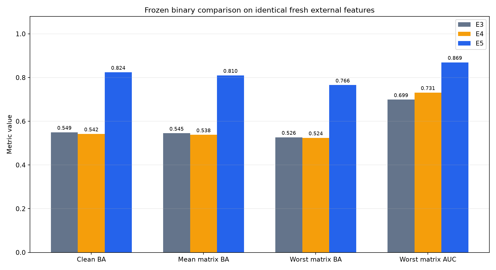
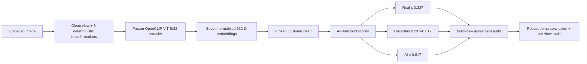
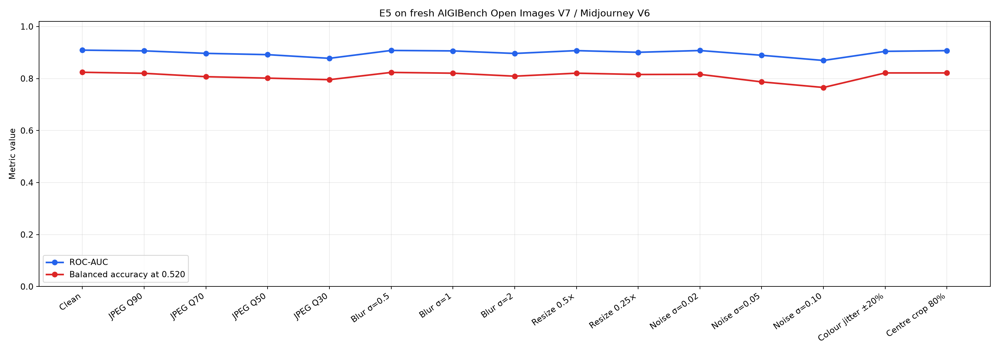

# AIGC Detector

A transformation-aware research prototype for detecting AI-generated images
without hiding model uncertainty.

The final **E5** detector combines a frozen OpenCLIP image encoder with a
513-parameter linear head trained on source-balanced real and generated
images. Its demo evaluates an uploaded image in seven deterministic views and
returns **Likely real**, **Uncertain**, or **Likely AI-generated**.

> **Research status:** E5 is the strongest model produced in this project, but
> it failed two predeclared external safety-risk gates. It must not be treated
> as proof of provenance or as a production-ready universal detector.



## Why this project exists

A detector can look excellent on images from a familiar generator and fail
after ordinary social-media processing or a change of image source. This
project therefore asks three questions:

1. Does the detector survive JPEG compression, blur, resize, noise, colour
   adjustment and cropping?
2. Does it generalise to a generator family never used for training?
3. Can it abstain instead of making a confident accusation when evidence is
   weak or unstable?

The experimental journey deliberately records failures. E4 showed that adding
only diverse real images fixed false accusations but destroyed AI recall. E5
corrected that confound by adding source-matched **real and FLUX-generated**
SID-Set supervision in balanced proportions.

## Final system



### Model specification

| Component | Frozen E5 setting |
| --- | --- |
| Encoder | OpenCLIP `ViT-B-32-quickgelu`, pretrained=`openai` |
| Encoder output | 512-dimensional L2-normalized embedding |
| Encoder training | Completely frozen; 0 trainable encoder parameters |
| Classifier | Logistic linear head: 512 weights + 1 bias |
| Training sources | CIFAKE real/AI + SID-Set real/FLUX |
| Per-epoch balance | 50% real/50% AI and 50% CIFAKE/50% SID-Set |
| Robustness training | Clean/transformed supervision + consistency loss |
| E3 anchor weight | `0.01` |
| Selected epoch | `40` |
| Three-way thresholds | real `≤0.237`; uncertain `(0.237, 0.817)`; AI `≥0.817` |
| Binary research threshold | `0.52`; comparison only, not the safety decision |
| Checkpoint | `checkpoints/clip_linear_e5_source_matched.npz` |
| Checkpoint SHA-256 | `b6c25a38a86692a74280650f516105c01efbaabe91f8da728b1a455cbf1756c4` |

The demo's extra multi-view rule is conservative: if the seven views cross
decision regions, the displayed robust conclusion becomes **Uncertain**. This
interface rule exposes instability; it was not used to rewrite the frozen
external benchmark result.

## Results

### Unseen Midjourney V6 external evaluation

The final one-time external test used 1,000 authentic AIGIBench images and
1,000 Midjourney V6 images. Midjourney was absent from E5 development. Models,
thresholds, data identities, transformations and pass/fail gates were frozen
before scores were computed.

| Model | Clean ROC-AUC | Clean balanced accuracy | 15-condition mean ROC-AUC | Worst-condition ROC-AUC |
| --- | ---: | ---: | ---: | ---: |
| E3: CIFAKE robust baseline | 0.7568 | 0.5495 | 0.7429 | 0.6989 |
| E4: real-only adaptation | 0.8088 | 0.5420 | 0.7890 | 0.7312 |
| **E5: source-matched real + AI** | **0.9091** | **0.8240** | **0.8986** | **0.8695** |

At the binary comparison threshold, clean E5 produced 877 true real calls,
123 real-as-AI errors, 771 detected Midjourney images and 229 missed
Midjourney images.



### Why the official external decision is still FAIL

E5 passed the frozen coverage and ROC-AUC gates, but failed both confident
error-risk limits under the three-way rule:

| Frozen external gate | Required | Observed worst-case 95% Wilson upper bound | Result |
| --- | ---: | ---: | --- |
| Real image confidently called AI | ≤ 5% | 9.74% | Fail |
| AI image confidently called real | ≤ 10% | 26.95% | Fail |
| Clean decisive coverage per class | ≥ 60% | 83.8% minimum | Pass |
| Worst primary-condition ROC-AUC | ≥ 0.80 | 0.8894 | Pass |

This does not make E5 useless. It makes the supported claim narrower:

It is not externally validated for safety-critical automatic decisions.

> E5 materially improves cross-source and cross-generator ranking and binary
> accuracy over E3/E4 on this frozen benchmark, but it is not externally
> validated for safety-critical automatic decisions.

### E1–E3 internal robustness development

All three models below used the same 2,000-image CIFAKE test split and the same
six representative transformations. Thresholds were selected using validation
data before the test comparison.

| Model | Training change | Clean balanced accuracy | Mean transformed BA | Worst transformed BA |
| --- | --- | ---: | ---: | ---: |
| E1 | Clean frozen-CLIP linear baseline | 0.9110 | 0.8503 | 0.7945 |
| E2 | Clean + transformed supervision | **0.9415** | 0.8904 | 0.8630 |
| E3 | E2 + prediction consistency loss | 0.9370 | **0.8925** | **0.8660** |

E3 was retained as the original robust binary baseline. On the later SID-Set
real/FLUX audit it achieved ROC-AUC `0.9325`, but called 64.6% of authentic SID
images AI. This exposed dataset/source bias rather than a lack of ranking
signal.

### What E4 taught us

E4 added only SID real images. Its authentic SID false-positive rate fell from
64.6% to 0.6%, but FLUX recall collapsed from 99.7% to 20.5%. The model learned
a new source shortcut: SID-like meant real. E5 therefore trained with both
real and FLUX SID images, while retaining balanced CIFAKE supervision.

## Run the demo

### Requirements

- macOS, Linux or Windows
- Python **3.12** recommended
- Approximately 2 GB free for the Python environment and downloaded CLIP
  weights
- Apple Silicon MPS, CUDA or CPU; a GPU is helpful but not required

Xcode is **not required** for the normal pinned installation because the main
dependencies install from prebuilt Python wheels. On macOS, use a Python 3.12
installation rather than relying on the older system `python3`.

From the repository root:

```bash
python3.12 -m venv .venv
source .venv/bin/activate
.venv/bin/python -m pip install -r requirements.txt
```

Start the local interface:

```bash
.venv/bin/python -m src.demo_app --device auto --inbrowser
```

The first launch downloads the OpenAI CLIP weights into the ignored
`checkpoints/open_clip/` cache. `--device auto` selects MPS or CUDA when
available and otherwise uses CPU. The local interface normally opens at
`http://127.0.0.1:7860`.

Do not add `--share` for private images. That option creates a public Gradio
tunnel; the default command remains local.

### Demo behaviour

For each upload, the app evaluates:

- clean image;
- JPEG quality 50;
- Gaussian blur σ=1;
- 0.5× downscale followed by upscale;
- Gaussian noise σ=0.05;
- deterministic colour jitter ±20%; and
- centre crop retaining 80%.

It shows the clean score, the seven per-view decisions, score spread,
decision-flip count and a conservative robust conclusion. Repeating the same
image reuses a bounded in-memory result cache; uploaded image bytes are not
written by the application.

## Directory inference

The command-line predictor writes one probability per readable image:

```bash
.venv/bin/python -m src.predict \
  --input-dir path/to/images \
  --recursive \
  --checkpoint checkpoints/clip_linear_e5_source_matched.npz \
  --output outputs/predictions.json \
  --device auto \
  --batch-size 32
```

The JSON output is a sorted array of records containing `image_path` and
`pred`. `pred` lies in `[0, 1]`; higher means more AI-like. This directory
command exports the frozen score. Use the Gradio demo when the three-way
thresholds and multi-view disagreement display are required.

## Verify a cloned repository

These commands require no raw third-party dataset images:

```bash
.venv/bin/python -m scripts.audit_submission --check-only
.venv/bin/python -m pytest -q
.venv/bin/python -m src.demo_app --help
```

The submission audit checks:

- organiser-validation exclusion records;
- absence of tracked raw images, feature caches and prediction exports;
- frozen manifest counts, labels and hashes;
- third-party license notices; and
- the exact E5 checkpoint SHA-256.

The complete test count is printed by `pytest`; the suite includes unit,
integration, protocol-lock, checkpoint-identity, leakage and documentation
contract tests.

## Research reproduction

The demo does not require the research datasets. The commands below reproduce
the main experimental stages and are intentionally separate because dataset
acquisition and CLIP extraction take hours and several gigabytes.

### 1. Prepare CIFAKE

Download the official CIFAKE archive from Kaggle and place it under
`data/raw/cifake/` with `train/REAL`, `train/FAKE`, `test/REAL` and `test/FAKE`
directories. Then create the deterministic seed-42 manifests:

```bash
.venv/bin/python -m scripts.prepare_cifake --verify-images
```

The project uses 10,000 train, 2,000 validation and 2,000 internal test images,
balanced by label. Validation is sampled only from CIFAKE's official training
split; the internal test manifest comes only from the official test split.

### 2. Extract frozen CLIP features

```bash
.venv/bin/python -m scripts.check_clip --device auto

.venv/bin/python -m scripts.extract_clip_features \
  --splits train val test \
  --device auto \
  --batch-size 32

.venv/bin/python -m scripts.extract_transformed_clip_features \
  --splits train val \
  --device auto \
  --batch-size 32
```

The encoder is never fine-tuned. Extraction writes ignored `.npz` caches and
tracked summary reports containing shapes, hashes and integrity checks.

### 3. Train and compare E1–E3

```bash
.venv/bin/python -m src.train_linear_probe
.venv/bin/python -m src.train_robust_linear --experiment e2 --device cpu
.venv/bin/python -m src.train_robust_linear --experiment e3 --device cpu
.venv/bin/python -m src.select_section3_thresholds

.venv/bin/python -m scripts.extract_transformed_clip_features \
  --splits test \
  --allow-test \
  --device auto \
  --batch-size 32

.venv/bin/python -m src.evaluate_section3
```

Threshold selection loads validation caches only. The separate `--allow-test`
step makes test access explicit after the models and selection rule are frozen.

### 4. Run the full transformation matrix

```bash
.venv/bin/python -m scripts.extract_transformed_clip_features \
  --splits test \
  --allow-test \
  --conditions \
    jpeg_q90 jpeg_q70 jpeg_q30 \
    gaussian_blur_sigma0_5 gaussian_blur_sigma2 \
    resize_0_25x \
    gaussian_noise_sigma0_02 gaussian_noise_sigma0_10 \
  --device auto \
  --batch-size 32

.venv/bin/python -m src.evaluate_full_matrix
.venv/bin/python -m src.bootstrap_uncertainty
.venv/bin/python -m src.error_analysis
```

### 5. Reproduce E5 development

SID-Set acquisition is deterministic and license-governed. It downloads 4,000
real and 4,000 FLUX training-source images, with disjoint 3,000/1,000
train/validation splits. Raw images and features remain ignored by Git.

```bash
.venv/bin/python -m scripts.prepare_e4_sid_real
.venv/bin/python -m scripts.prepare_e5_sid_flux

.venv/bin/python -m scripts.extract_clip_features \
  --splits train val \
  --manifest-dir data/processed/e4_sid_real \
  --output-dir data/features/e4_sid_real_clip_vit_b32_quickgelu_openai \
  --summary-output reports/e4_sid_real_clip_embedding_summary.json \
  --device auto --batch-size 32

.venv/bin/python -m scripts.extract_transformed_clip_features \
  --splits train val \
  --allow-single-class-real \
  --clean-feature-dir data/features/e4_sid_real_clip_vit_b32_quickgelu_openai \
  --output-dir data/features/e4_sid_real_clip_transformed_seed42 \
  --summary-output reports/e4_sid_real_transformed_embedding_summary.json \
  --device auto --batch-size 32 --seed 42

.venv/bin/python -m scripts.extract_clip_features \
  --splits train val \
  --manifest-dir data/processed/e5_sid_flux \
  --output-dir data/features/e5_sid_flux_clip_vit_b32_quickgelu_openai \
  --summary-output reports/e5_sid_flux_clip_embedding_summary.json \
  --device auto --batch-size 32

.venv/bin/python -m scripts.extract_transformed_clip_features \
  --splits train val \
  --allow-single-class-ai \
  --clean-feature-dir data/features/e5_sid_flux_clip_vit_b32_quickgelu_openai \
  --output-dir data/features/e5_sid_flux_clip_transformed_seed42 \
  --summary-output reports/e5_sid_flux_transformed_embedding_summary.json \
  --device auto --batch-size 32 --seed 42

.venv/bin/python -m src.train_e5 --device cpu
```

E5 trains all four frozen anchor-weight candidates and rejects the experiment
if no candidate satisfies the predeclared validation error and coverage rules.

### 6. Frozen external AIGIBench evaluation

The external run was a single-use audit, not a hyperparameter search. The
checked-in protocol, amendment, run lock, manifests, feature hashes, metrics
and figures preserve the completed evidence. Do not delete those frozen
artifacts merely to rerun the one-time test.

For an authorised independent replication in a separate worktree with the
frozen output paths initially absent, the historical command sequence was:

```bash
.venv/bin/python -m scripts.prepare_e5_external_aigibench_deduplicated
.venv/bin/python -m scripts.extract_e5_aigibench_clip_features \
  --device auto --batch-size 32
.venv/bin/python -m scripts.extract_e5_aigibench_transformed_clip_features \
  --device auto --batch-size 32
.venv/bin/python -m src.evaluate_e5_aigibench_external
```

AIGIBench is CC-BY-NC-SA-4.0 and was used only for non-commercial research
evaluation. See [dataset and license notices](docs/DATASETS_AND_LICENSES.md).

## Repository map

| Path | Purpose |
| --- | --- |
| `src/demo_app.py` | Gradio interface |
| `src/demo_inference.py` | Exact E5 checkpoint validation and seven-view inference |
| `src/train_e5.py` | Source-balanced E5 training and frozen selection |
| `src/evaluate_e5_aigibench_external.py` | One-time external evaluation |
| `src/predict.py` | Directory-to-JSON score inference |
| `scripts/` | Dataset preparation, feature extraction and audits |
| `configs/` | Frozen experiment protocols and run locks |
| `reports/` | Aggregate metrics and non-image figures |
| `checkpoints/clip_linear_e5_source_matched.npz` | Final small linear head |
| `tests/` | Unit, integration, protocol and leakage tests |

## Limitations and future E6 direction

- **Not universal:** training covers Stable Diffusion-based CIFAKE and FLUX;
  external testing covers one Midjourney V6 subset.
- **Semantic encoder:** CLIP's 224 × 224 preprocessing can suppress subtle
  pixel-frequency forensic evidence.
- **Source bias remains:** source and generator coverage improved, but the
  external risk bounds still failed.
- **Transformation scope is finite:** the matrix cannot represent every social
  platform, screenshot pipeline, edit or adversarial attack.
- **Thresholds are domain-sensitive:** the three-way thresholds are frozen from
  development data and must not be silently recalibrated on the external test.
- **No provenance proof:** metadata standards, content credentials and human
  review remain necessary for consequential decisions.

A future E6 should add a third generator family to training while keeping
Midjourney held out, combine CLIP with a frequency/high-pass forensic branch,
and evaluate calibration with ECE or reliability diagrams under a newly frozen
protocol.

## Data, citations and licensing

The organiser validation subset was never used for development or evaluation.
The automated evidence is in `reports/submission_audit.json` and can be checked
with `python -m scripts.audit_submission --check-only`.

Third-party datasets retain their own licenses. No third-party image bytes or
downloaded CLIP weights are committed. Full sources and attribution notes are
in [docs/DATASETS_AND_LICENSES.md](docs/DATASETS_AND_LICENSES.md).

Original project code is released under the [MIT License](LICENSE).

## Responsible-use statement

An AI-image score can be wrong because of generator shift, editing, compression,
camera/source differences or content bias. Do not use this prototype by itself
to accuse a person of deception, moderate high-impact content, determine legal
authenticity or make another consequential decision.
