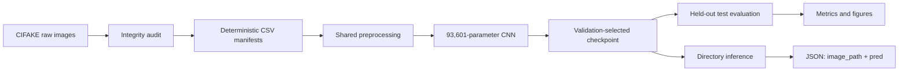
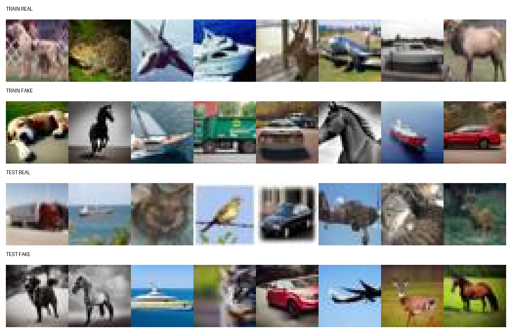
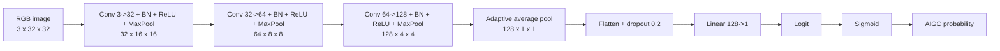
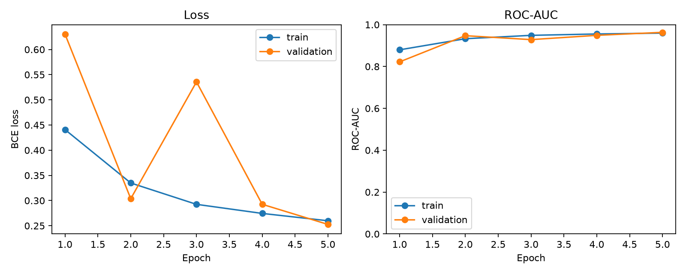
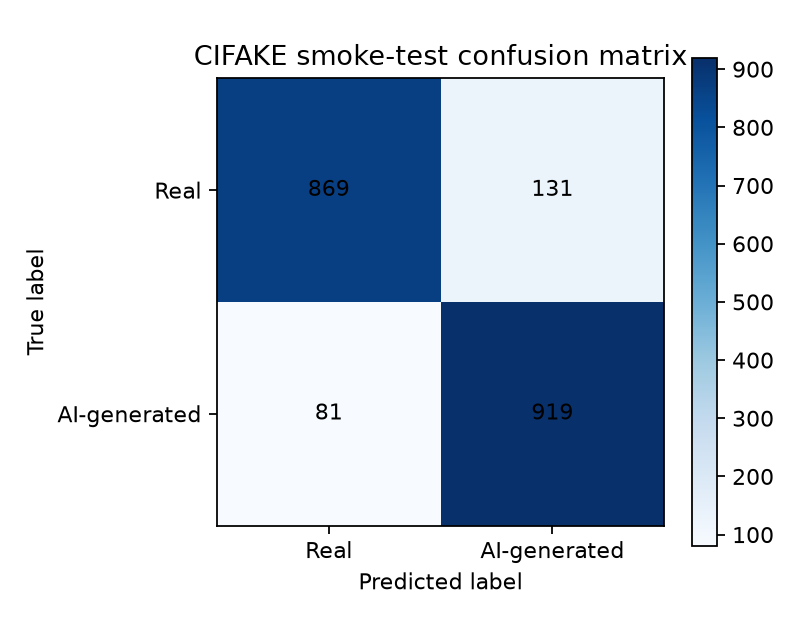

# Section 1 Technical Report: CIFAKE Smoke-Test Pipeline

**Report date:** 29 August 2026  
**Covered work:** Sections 1A-1E

## 1. Purpose and scope

Section 1 built and verified the first complete version of the AIGC Detector
pipeline:

1. prepare a reproducible Python and Git environment;
2. acquire and inspect a labelled image dataset;
3. standardise labels and create leakage-safe manifests;
4. define a model and a stable checkpoint format;
5. implement the required image-directory-to-JSON interface;
6. train a small binary classifier;
7. evaluate it on held-out data; and
8. verify the implementation with automated tests.

The purpose was **engineering validation**, not state-of-the-art detection. The
small CNN and CIFAKE dataset act as a *smoke test*: if this compact pipeline
cannot train, evaluate, save, reload, and produce valid JSON, it would be risky
to introduce CLIP, robustness augmentations, or multiple datasets.

The completed flow is:



## 2. Section 1 decision log

| Decision | What was done | Reason |
| --- | --- | --- |
| Avoid full Xcode | Used the already-installed Apple Command Line Tools | Python, Git, and the selected binary packages did not require the multi-gigabyte Xcode application. |
| Isolate Python packages | Created a local `.venv` | Prevents project dependencies from changing the system Python or unrelated projects. |
| Remove `.venv` from Git | Added `.venv/` to `.gitignore` and stopped tracking it | Virtual environments contain generated, machine-specific files and absolute paths. |
| Start with CIFAKE | Used it only as a smoke-test dataset | It is small and balanced, making end-to-end debugging fast. Its 32 x 32 resolution is not representative of real redistributed images. |
| Use manifests | Stored paths and labels in CSV instead of copying images | Makes splits auditable, reproducible, portable, and cheap to regenerate. |
| Fix labels globally | Defined `0 = real`, `1 = AI-generated` | Prevents label inversion across datasets, metrics, checkpoints, and JSON outputs. |
| Preserve test separation | Validation came from the official training partition; test came from the official test partition | Prevents using test images for checkpoint selection. |
| Use a compact CNN | Built a 93,601-parameter model | Sufficient to validate the training system without spending compute on a model that is not the final research baseline. |
| Select by validation ROC-AUC | Saved the checkpoint with the highest validation ROC-AUC | ROC-AUC evaluates ranking without binding model selection to an arbitrary classification threshold. |
| Keep training clean | Applied deterministic resizing and normalisation, but no robustness augmentations | Establishes an unaugmented reference before testing augmentation and consistency training later. |
| Use a self-describing checkpoint | Saved architecture, weights, preprocessing, labels, epoch, and metrics together | Prevents inference from silently using the wrong preprocessing or label meaning. |

## 3. Development environment

### 3.1 Observed system

The initial machine audit found:

| Component | Observed value |
| --- | --- |
| Operating system | macOS 14.5 |
| Processor architecture | Apple Silicon / `arm64` |
| Free disk space at audit | approximately 191 GiB |
| Python | 3.12.1 |
| pip after environment recreation | 26.2.1 |
| PyTorch used by the project | 2.13.0 |
| Pinned distributions in `requirements.txt` | 43 |
| Git | 2.47.1 |
| Editor command | VS Code `code` command available |
| Apple development tools | Command Line Tools installed |

Full Xcode was unnecessary. The Command Line Tools already supplied the system
components needed by Git and any packages that might require compilation.

### 3.2 Virtual-environment path issue

The project directory was temporarily renamed from `AI generated image` to
`AIGC Detector`. A Python virtual environment stores absolute paths in files
such as `.venv/bin/activate`, so after moving the directory, activation still
pointed at the previous location. The visible symptoms were:

- `python` stopped resolving after activation;
- `python3` resolved to a different system interpreter; and
- the MPS availability result changed because a different Python/PyTorch
  installation was being tested.

The correct repair was to recreate `.venv` at the final project path rather
than editing one activation script. Other entry points inside a virtual
environment can also contain absolute paths.

The normal user Terminal reported Apple MPS capability, while the Codex
sandbox did not expose the GPU. For that reason, the recorded five-epoch run
used CPU. The training code still selects devices in this order when
`--device auto` is used:

```text
CUDA -> Apple MPS -> CPU
```

### 3.3 Repository hygiene

The initial Git commit accidentally tracked `.venv`. This was corrected with
`git rm --cached`, so the local environment remained available while Git
stopped tracking it. No credentials were found in the committed content.

The final ignore policy excludes:

- `.venv` and Python caches;
- raw image data;
- model checkpoints;
- temporary output predictions;
- `.env` and `kaggle.json` credentials; and
- downloaded archives.

Final report figures are intentionally not ignored, because they are useful
evidence for reviewers.

## 4. CIFAKE acquisition and audit

### 4.1 Download and storage

The public Kaggle dataset handle used was:

```text
birdy654/cifake-real-and-ai-generated-synthetic-images
```

KaggleHub downloaded and extracted it into the ignored directory
`data/raw/cifake`.

| Property | Observed value |
| --- | ---: |
| Downloaded archive | approximately 105 MB |
| Extracted dataset | approximately 469 MB |
| Total images | 120,000 |
| File format | JPEG |
| Colour mode | RGB |
| Resolution | 32 x 32 pixels |
| Corrupt/unreadable files | 0 |

### 4.2 Official directory counts

| Official partition | Folder | Images |
| --- | --- | ---: |
| Train | `REAL` | 50,000 |
| Train | `FAKE` | 50,000 |
| Test | `REAL` | 10,000 |
| Test | `FAKE` | 10,000 |
| **Total** |  | **120,000** |

Every image was opened with Pillow, its size and mode were recorded, and
`Image.verify()` was called. This full audit found exactly one consistent image
shape/mode combination—32 x 32 RGB—and no unreadable files.

### 4.3 Visual audit



The visual sample was selected with seed `42`. It confirmed that both `REAL`
and `FAKE` directories contain CIFAR-style semantic categories rather than an
obvious folder-placement mistake.

However, visual similarity at 32 x 32 is also a limitation. A detector may
learn dataset- or resampling-specific shortcuts that do not survive on modern
high-resolution generated images.

## 5. Label and split standardisation

### 5.1 Project-wide label contract

The entire project uses:

```text
0 = authentic / real
1 = AI-generated / fake
```

This direction is important because `pred` is defined as the probability of
class `1`. Therefore:

- a prediction near `0` means *more likely real*; and
- a prediction near `1` means *more likely AI-generated*.

### 5.2 Manifest schema

Each CSV row contains:

| Field | Meaning |
| --- | --- |
| `image_path` | Repository-relative path to the raw image |
| `label` | `0` for real or `1` for AI-generated |
| `class_name` | Human-readable `real` or `ai_generated` |
| `source` | Dataset identifier, currently `cifake` |
| `split` | `train`, `val`, or `test` |

Example:

```csv
image_path,label,class_name,source,split
data/raw/cifake/train/REAL/example.jpg,0,real,cifake,train
data/raw/cifake/train/FAKE/example.jpg,1,ai_generated,cifake,train
```

Relative paths were chosen instead of absolute `/Users/...` paths so the
manifests work after cloning the repository elsewhere.

### 5.3 Sampling strategy

The raw images were not copied. `scripts/prepare_cifake.py` shuffles sorted
paths deterministically and writes manifests using seed `42`.

| Project split | Source partition | Real | AI-generated | Total |
| --- | --- | ---: | ---: | ---: |
| Train | CIFAKE official train | 5,000 | 5,000 | 10,000 |
| Validation | disjoint CIFAKE official train sample | 1,000 | 1,000 | 2,000 |
| Test | CIFAKE official test | 1,000 | 1,000 | 2,000 |
| **Total selected** |  | **7,000** | **7,000** | **14,000** |

The smaller selection was deliberate. Section 1 required fast verification,
not maximum CIFAKE performance. The unused images remain available locally for
later diagnostics.

Validation and training use distinct paths from the official training pool.
The test manifest only uses the official test pool. Automated and direct audits
verified:

- 14,000 unique paths;
- zero paths shared across manifests;
- exact 50/50 class balance in every split;
- every referenced file exists;
- every `/REAL/` path has label `0`; and
- every `/FAKE/` path has label `1`.

This prevents **split leakage**, where the same observation influences both
model fitting and evaluation.

## 6. Shared preprocessing

Training, evaluation, and inference use the same function in `src/data.py`:

1. open the image and convert it to RGB;
2. resize to 32 x 32 with antialiasing;
3. convert pixel values from integers to a tensor in `[0, 1]`; and
4. normalise each RGB channel with mean `0.5` and standard deviation `0.5`.

For a pixel value `x` in `[0, 1]`, normalisation computes:

```text
(x - 0.5) / 0.5
```

This maps approximately `[0, 1]` to `[-1, 1]`.

Centralising preprocessing prevents **training-serving skew**: a model trained
on one resize or normalisation rule but evaluated with another.

No blur, JPEG compression, noise, crop, colour jitter, or other robustness
augmentation was used in Section 1. Those belong to controlled later
experiments.

## 7. CNN architecture

### 7.1 Data flow



### 7.2 Layer details

| Stage | Operation | Output shape per image | Trainable parameters |
| --- | --- | --- | ---: |
| Input | RGB tensor | `3 x 32 x 32` | 0 |
| Block 1 | 3 x 3 convolution, batch norm, ReLU, 2 x 2 max pool | `32 x 16 x 16` | 928 |
| Block 2 | 3 x 3 convolution, batch norm, ReLU, 2 x 2 max pool | `64 x 8 x 8` | 18,560 |
| Block 3 | 3 x 3 convolution, batch norm, ReLU, 2 x 2 max pool | `128 x 4 x 4` | 73,984 |
| Pool | Adaptive average pooling | `128 x 1 x 1` | 0 |
| Head | Flatten, dropout 0.2, linear 128 to 1 | `1` logit | 129 |
| **Total** |  |  | **93,601** |

Batch normalisation contributes two trainable values per channel—a scale and
an offset. Its running mean and variance are stored state, but not trainable
parameters.

The model produces a **logit**, an unrestricted real number. Inference converts
it to a probability with the sigmoid function:

```text
sigmoid(z) = 1 / (1 + exp(-z))
```

## 8. Checkpoint and inference contract

### 8.1 Self-describing checkpoint

The saved `.pt` checkpoint contains:

| Key | Purpose |
| --- | --- |
| `checkpoint_version` | Allows future format changes to be detected |
| `model_config` | Architecture name, base channels, and dropout |
| `model_state_dict` | Learned tensors |
| `preprocessing` | Image size, mean, standard deviation, and RGB mode |
| `label_mapping` | Confirms `real = 0`, `ai_generated = 1` |
| `epoch` | Epoch that produced the checkpoint |
| `metrics` | Validation metrics associated with that epoch |

Loading uses `torch.load(..., weights_only=True)` and validates the version,
architecture, fields, and label mapping before applying weights.

The best local checkpoint is approximately 384 KB. Checkpoints remain ignored
by Git in Section 1; they are reproducible by running the documented training
command.

### 8.2 JSON prediction interface

The required command shape is:

```bash
python -m src.predict \
  --input-dir <image-directory> \
  --checkpoint <checkpoint.pt> \
  --output <predictions.json>
```

Each output entry contains exactly:

```json
{
  "image_path": "path/to/image.jpg",
  "pred": 0.873142
}
```

Important implementation behaviours:

- supported extensions are JPG, JPEG, PNG, WebP, BMP, TIFF, and TIF;
- paths are sorted for deterministic output ordering;
- inference is batched;
- `torch.inference_mode()` prevents gradient storage;
- models are switched to evaluation mode;
- corrupt files are reported and skipped by default;
- `--strict` converts corrupt images into a fatal error;
- `--recursive` searches subdirectories; and
- JSON is written to a temporary file and atomically renamed, reducing the
  chance of leaving a partially written result after interruption.

Before training, this interface was tested with a random checkpoint. Scores
near 0.5 were expected and were not treated as model performance. This separated
interface correctness from learning correctness.

## 9. Training configuration

The recorded run used:

| Setting | Value |
| --- | --- |
| Random seed | 42 |
| Device | CPU, because the Codex sandbox did not expose MPS |
| Training samples | 10,000 |
| Validation samples | 2,000 |
| Epochs | 5 |
| Batch size | 256 |
| Optimiser | AdamW |
| Learning rate | 0.001 |
| Weight decay | 0.0001 |
| Loss | `BCEWithLogitsLoss` |
| Selection metric | validation ROC-AUC |
| Selection result | epoch 5 |

An **epoch** is one pass through the training manifest. A **batch** is the group
of images processed before one optimiser update. With 10,000 examples and a
batch size of 256, each epoch contains 40 optimiser steps, with the last batch
smaller than 256.

`BCEWithLogitsLoss` combines sigmoid and binary cross-entropy in a numerically
stable operation. AdamW updates model weights using adaptive gradient estimates
and applies weight decay separately to discourage excessively large weights.

The seed controls Python, NumPy, PyTorch, manifest sampling, and DataLoader
shuffle ordering. It improves reproducibility but does not guarantee identical
floating-point results across CPU, MPS, and CUDA implementations.

## 10. Training behaviour

| Epoch | Train loss | Train ROC-AUC | Validation loss | Validation ROC-AUC | Validation balanced accuracy | Validation recall |
| ---: | ---: | ---: | ---: | ---: | ---: | ---: |
| 1 | 0.4409 | 0.8798 | 0.6304 | 0.8222 | 0.6765 | 0.4300 |
| 2 | 0.3349 | 0.9328 | 0.3037 | 0.9473 | 0.8705 | 0.8380 |
| 3 | 0.2925 | 0.9489 | 0.5357 | 0.9285 | 0.7505 | 0.5280 |
| 4 | 0.2745 | 0.9555 | 0.2926 | 0.9490 | 0.8780 | 0.8580 |
| 5 | 0.2599 | 0.9597 | 0.2527 | **0.9633** | **0.8975** | **0.9130** |



Training loss generally decreased and training ROC-AUC increased each epoch.
Validation performance temporarily deteriorated at epoch 3: recall fell to
0.528 even though precision rose to 0.951. This means the 0.5 threshold became
temporarily conservative, labelling many generated images as real. The run did
not assume that later epochs are always better; checkpoint selection compared
validation ROC-AUC after every epoch.

The best validation ROC-AUC occurred at epoch 5, so that model was saved and
used for test evaluation.

## 11. Held-out test result

The epoch-5 checkpoint was evaluated once on the 2,000-image test manifest.
The threshold remained at the default `0.5`; it was not tuned on the test data.

| Metric | Test result | Interpretation |
| --- | ---: | --- |
| ROC-AUC | **0.9570** | Strong ranking between real and generated images within this CIFAKE sample |
| Average precision | **0.9558** | High precision-recall ranking for the AI-generated class |
| Accuracy | **0.8940** | 89.4% of test images received the correct 0.5-threshold label |
| Balanced accuracy | **0.8940** | Same as accuracy because the test set is exactly balanced |
| Precision | **0.8752** | Of images predicted generated, 87.52% were generated |
| Recall / sensitivity | **0.9190** | Detected 91.9% of generated images |
| F1 | **0.8966** | Harmonic balance of precision and recall |
| Brier score | **0.0808** | Mean squared probability error; lower is better |
| BCE loss | **0.2695** | Probabilistic binary cross-entropy on the test set |

### 11.1 Confusion matrix



Using rows as true classes and columns as predicted classes:

|  | Predicted real | Predicted AI-generated |
| --- | ---: | ---: |
| True real | 869 true negatives | 131 false positives |
| True AI-generated | 81 false negatives | 919 true positives |

Derived error rates:

- false-positive rate: `131 / 1000 = 13.1%`;
- false-negative rate: `81 / 1000 = 8.1%`;
- specificity: `869 / 1000 = 86.9%`; and
- sensitivity/recall: `919 / 1000 = 91.9%`.

The asymmetric errors show that, at threshold 0.5, this model is more likely to
flag a real CIFAKE image incorrectly than to miss a generated CIFAKE image.
That trade-off will matter when choosing thresholds for real use cases.

### 11.2 Full-directory inference stress check

After evaluation, the learned checkpoint processed all 20,000 images in
CIFAKE's official test directory through `src.predict`:

- output rows: 20,000;
- unreadable/skipped images: 0;
- schema failures: 0;
- mean `pred` for `REAL`: 0.1785; and
- mean `pred` for `FAKE`: 0.8549.

This was a throughput/interface check, not an independent second test result.
It includes the 2,000 images already present in the test manifest and therefore
must not be presented as additional independent evidence.

## 12. Automated verification

Six tests passed at the end of Section 1.

### 12.1 Manifest tests

`tests/test_prepare_cifake.py` constructs a miniature temporary directory and
checks that manifest generation:

- produces balanced train, validation, and test sets;
- preserves labels `0` and `1`;
- creates no shared paths;
- records the correct split name; and
- produces byte-identical CSVs when rerun with the same seed.

### 12.2 Prediction tests

`tests/test_predict.py` checks that inference:

- loads temporary real images;
- skips a deliberately corrupt JPG;
- ignores unsupported text files;
- emits entries with exactly `image_path` and `pred`;
- keeps every probability in `[0, 1]`;
- sorts image paths deterministically;
- distinguishes recursive from non-recursive discovery; and
- rejects an empty input directory.

### 12.3 Data and metric tests

`tests/test_training_components.py` checks that:

- a grayscale source image is converted into a three-channel 32 x 32 tensor;
- labels become floating-point tensors for binary cross-entropy; and
- known perfect predictions produce ROC-AUC, balanced accuracy, and F1 of 1.0
  with the expected confusion matrix.

The final test command and result were:

```text
python -m pytest -q
...... [100%]
6 passed
```

## 13. Repository artifacts and responsibilities

| Path | Responsibility |
| --- | --- |
| `scripts/prepare_cifake.py` | Deterministic CIFAKE path sampling and manifest generation |
| `data/processed/*.csv` | Auditable train, validation, and test membership |
| `data/processed/dataset_summary.json` | Split counts, seed, labels, and strategy metadata |
| `src/data.py` | Shared transform and manifest-backed Dataset |
| `src/device.py` | CUDA/MPS/CPU selection |
| `src/model.py` | CNN architecture and checkpoint contract |
| `src/metrics.py` | Binary metrics and batched evaluation |
| `src/train.py` | Seeded training, validation, best-checkpoint selection, and history plot |
| `src/evaluate.py` | Test metrics, per-image predictions, and confusion matrix |
| `src/predict.py` | Submission-facing image-directory-to-JSON inference |
| `tests/` | Manifest, inference, data, and metric regression tests |
| `reports/cifake_training_history.json` | Complete per-epoch metrics |
| `reports/cifake_smoke_test.json` | Held-out test metrics and checkpoint information |
| `reports/figures/` | Dataset sample, training curve, and confusion matrix |

## 14. Key terminology

| Term | Meaning in this project |
| --- | --- |
| AIGC | AI-generated content; here, fully generated images |
| Smoke test | A small end-to-end run intended to expose broken plumbing, not prove research performance |
| Manifest | CSV defining image paths, labels, sources, and split membership |
| Split leakage | The same or derived observation affecting both training/model selection and evaluation |
| Label mapping | The agreed numeric meaning of real and generated classes |
| Class balance | Equal numbers of real and generated images in a split |
| Seed | Initial value controlling pseudo-random sampling and ordering |
| Preprocessing | Deterministic conversion from stored image to model input tensor |
| CNN | Convolutional neural network; learns spatial filters from image pixels |
| Batch normalisation | Normalises intermediate channel activations using learned scale/offset and running statistics |
| Logit | Raw classifier output before conversion to a probability |
| Sigmoid | Function mapping a logit into `[0, 1]` |
| Binary cross-entropy | Loss penalising incorrect binary probabilities |
| AdamW | Adaptive-gradient optimiser with decoupled weight decay |
| Epoch | One pass through the training dataset |
| Batch | Examples used together for one forward/backward optimisation step |
| Checkpoint | Saved learned weights plus enough metadata to reconstruct inference |
| Threshold | Probability boundary used to turn scores into class labels; 0.5 in Section 1 |
| ROC-AUC | Probability that a random positive receives a higher score than a random negative |
| Average precision | Summary of the precision-recall ranking curve |
| Precision | Fraction of predicted generated images that are actually generated |
| Recall | Fraction of generated images detected by the model |
| F1 | Harmonic mean of precision and recall |
| Balanced accuracy | Mean recall across the two classes |
| Brier score | Mean squared difference between probability and binary outcome |
| False positive | Real image incorrectly flagged as AI-generated |
| False negative | AI-generated image incorrectly classified as real |
| MPS | Apple's Metal Performance Shaders backend used by PyTorch on supported Macs |
| Frozen encoder | Pretrained feature extractor whose weights are not updated; introduced in Section 2 with CLIP |

## 15. What Section 1 does not prove

The reported scores must be interpreted narrowly. Section 1 does **not** prove:

- performance on high-resolution photography;
- robustness after JPEG recompression, blur, resizing, noise, colour editing,
  or cropping;
- generalisation to unseen image generators;
- generalisation to different real-image datasets;
- calibration suitable for moderation or forensic claims;
- resilience to deliberate adversarial evasion; or
- production readiness.

Specific limitations include:

1. **Low resolution:** every CIFAKE image is only 32 x 32.
2. **Dataset shortcuts:** real and generated classes may differ in processing
   characteristics unrelated to universal generation evidence.
3. **Single dataset:** no cross-source or held-out-generator evaluation was
   performed.
4. **No robustness transformations:** the model only saw clean CIFAKE images.
5. **Untuned threshold:** 0.5 was retained rather than selected for a deployment
   cost or target false-positive rate.
6. **No calibration stage:** Brier score was measured, but temperature scaling
   or another calibration method was not applied.
7. **One recorded seed/run:** statistical variation across multiple training
   seeds was not estimated.

For these reasons, the correct conclusion is:

> The repository can reproducibly prepare data, train and select a binary image
> classifier, evaluate held-out data, save/load a validated checkpoint, and
> produce the required JSON format. Robust AIGC detection remains the research
> task for later sections.

## 16. Exact reproduction sequence

From the repository root:

```bash
# Create and activate the environment
python3 -m venv .venv
source .venv/bin/activate
python -m pip install -r requirements.txt

# Download CIFAKE
python -c "import kagglehub; kagglehub.dataset_download(
    'birdy654/cifake-real-and-ai-generated-synthetic-images',
    output_dir='data/raw/cifake'
)"

# Recreate and verify manifests
python -m scripts.prepare_cifake --verify-images

# Run automated checks
python -m pytest -q

# Reproduce the recorded training configuration
python -m src.train --device cpu --epochs 5 --batch-size 256

# Evaluate the validation-selected checkpoint
python -m src.evaluate --device cpu --batch-size 256

# Exercise the submission JSON interface on the complete test directory
python -m src.predict \
  --input-dir data/raw/cifake/test \
  --recursive \
  --checkpoint checkpoints/cifake_cnn.pt \
  --output outputs/cifake_full_test_predictions.json \
  --batch-size 256 \
  --device cpu
```

On a Mac where `torch.backends.mps.is_available()` is `True`, `--device mps`
or the default `--device auto` can use the Apple GPU. Small numerical
differences from the recorded CPU run are possible.

## 17. Transition to Section 2

Section 1 proved the mechanics. Section 2 changes the research question from
"does the pipeline work?" to "do pretrained features generalise better?"

The next baseline will:

1. install OpenCLIP;
2. use a pretrained CLIP image encoder without updating its weights;
3. cache one embedding vector per image;
4. train a lightweight linear classifier on those embeddings;
5. keep the same label and evaluation contracts; and
6. compare clean images with transformed images.

Because Section 1 centralised labels, manifests, metrics, devices, and JSON
output, those components can be reused rather than rewritten.
