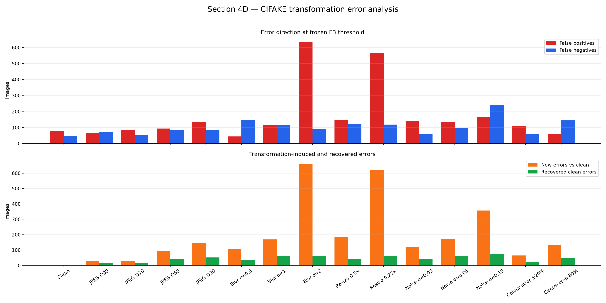
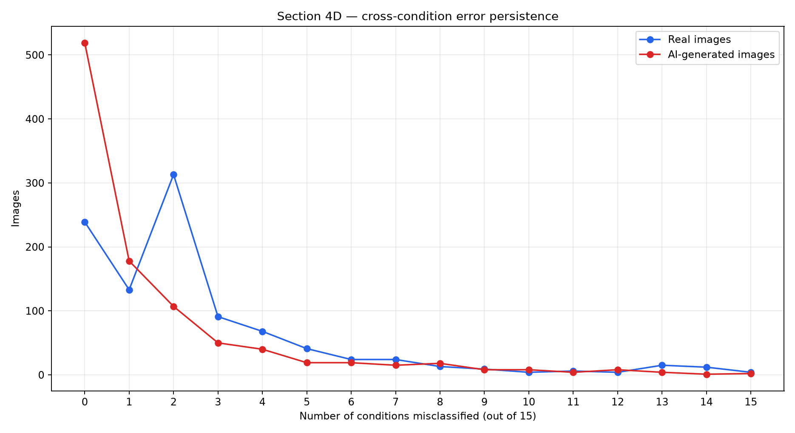
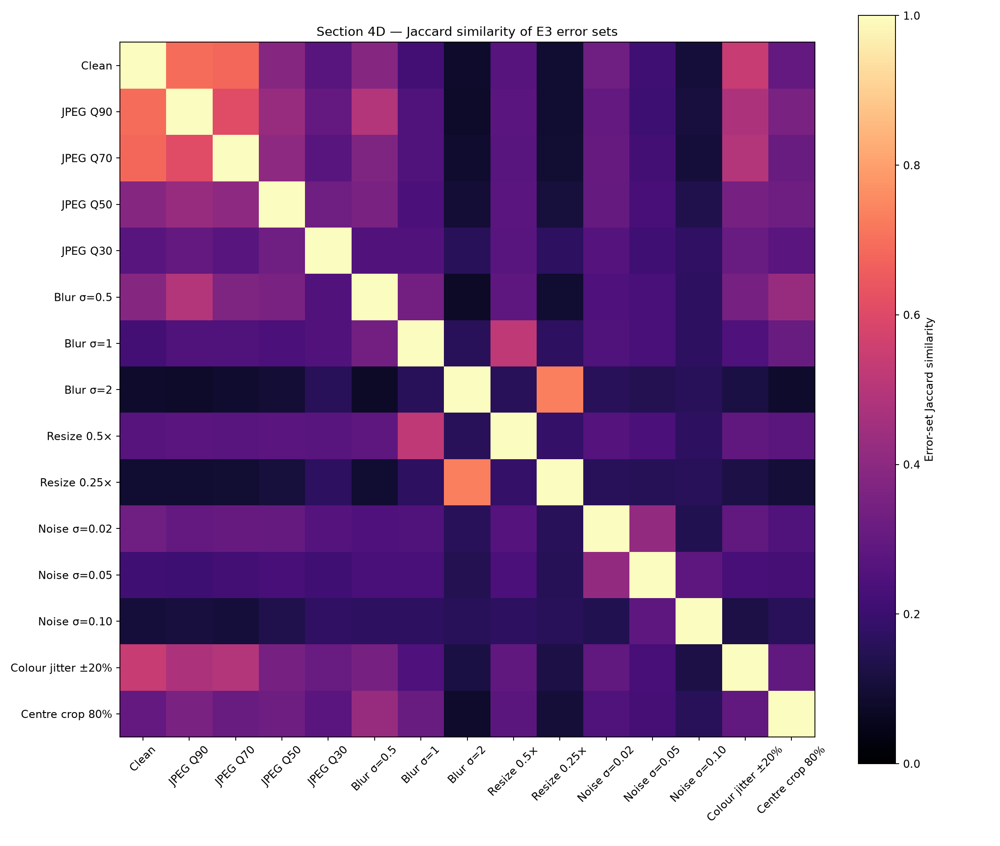
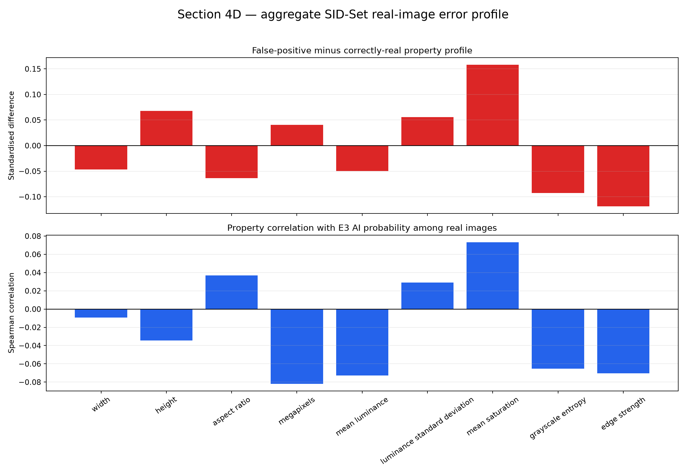

# Section 4D Error Analysis

This note analyses the already-frozen E3 detector. No result in this document was used to retrain the model, alter threshold 0.437, or reselect the primary model.

## Main findings

- On held-out SID-Set/FLUX, E3 correctly detects **997 / 1,000** FLUX images but falsely flags **646 / 1,000** real images.
- The real-image false-positive rate is **64.6%**; the paired-bootstrap 95% interval is **61.4%–67.5%**.
- Severe blur σ=2 produces **635 false positives** and **93 false negatives** on CIFAKE.
- Severe 0.25× resizing produces **567 false positives** and **119 false negatives**.
- Across all 15 CIFAKE conditions, **761 / 1,000 real** and **481 / 1,000 AI-generated** images fail at least once.
- **1116 / 2,000** CIFAKE images are correct when clean but fail under at least one transformation.

## Transformation failure direction

The strongest blur and resize settings create many false positives, meaning destructive resampling can remove or alter cues that E3 associates with authentic images. Strong noise instead produces more missed AI images, showing that different transformations shift scores in different directions.

## Cross-condition persistence

Repeated failures are not uniformly distributed. A subset of images fails under several conditions, while many remain correct throughout. The error-set co-occurrence heatmap helps distinguish shared failure groups from transformation-specific failures.

The largest off-diagonal overlap is **0.731 Jaccard similarity** between **Blur σ=2** and **Resize 0.25×**. Those two destructive resampling conditions therefore tend to break many of the same images.

## Held-out real-image false positives

All measured low-level associations are weak: the largest absolute standardised mean difference is **0.158** for **mean saturation**. Simple size, brightness, colour, entropy, and edge measurements therefore do not explain the high external-real false-positive rate.

These property associations are descriptive, not causal. They cannot separate generator artefacts from differences in dataset source, content, image resolution, or processing pipeline. Individual SID-Set images and paths are not included because their source attribution is unavailable through the sampled dataset interface.

## Deployment implication

E3 is suitable as a research prototype and ranking signal, but not as an automatic moderation decision-maker. A deployment-oriented version needs source-diverse real images, separate external calibration data, a low-false-positive operating point, and an abstention or uncertainty outcome.

## Guardrails and limitations

- Image-property associations are descriptive and do not establish causal failure mechanisms.
- SID-Set real and FLUX images may differ in source, content, resolution, and processing pipeline.
- Only three held-out FLUX false negatives exist, so their aggregate profile is unstable.
- The analysis covers one external generator and cannot establish universal cross-generator behaviour.
- The organiser validation subset was never used.
- No SID-Set images are displayed or committed.
- Per-image records remain under the Git-ignored `outputs/` directory.
